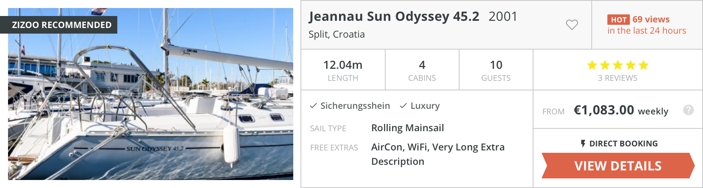

# Zizoo Frontend Code Challenge

## Goal

Create a single web page rendering search results similar to https://www.zizoo.com/en/search/

## Tasks

- Create simple react component for a search listing card based located in this repo.
- Request search results from a **GraphQL API** for all **active** boats.
- Render the results using the API response and the react component.
- Create a basic filtering solution for boat length (< 15 OR >= 15) and boat year (< 2010 OR >= 2010).
- Bonus (not mandatory): Instead of a static boat photo, implement a photo-slider.
  - _You can also repeat the same image, it doesn't need to be different or use placeholders for more images_
    like:
    - [https://placeholder.com/](https://placeholder.com/)
    - [https://loremflickr.com/](https://loremflickr.com/)

## GraphQL details

- Schema: [playground](https://sls-sandbox.zizoo.com/graphql)
- Endpoint: https://sls-sandbox.zizoo.com/graphql

## Test submission process and evaluation

- Upload a zip file containing the solution’s source code to Greenhouse.
- The solution should be built and run using `npm run`.
- The search result page should be accessible using the path http://localhost:[PORT]/search
- The solution will be evaluated for functionality, UX and coding style *In that order*.
- *Important* Pixel perfect implementation is not a priority.

## Estimated solution Time

4-6 hours

## UI Design

